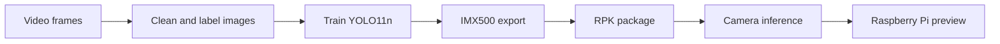
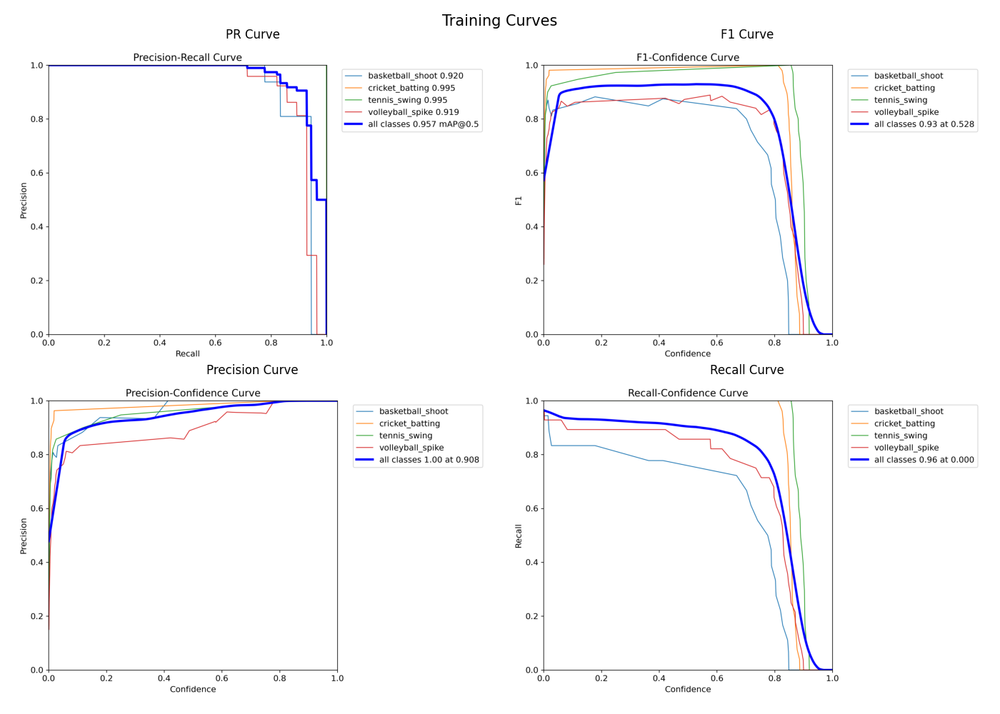
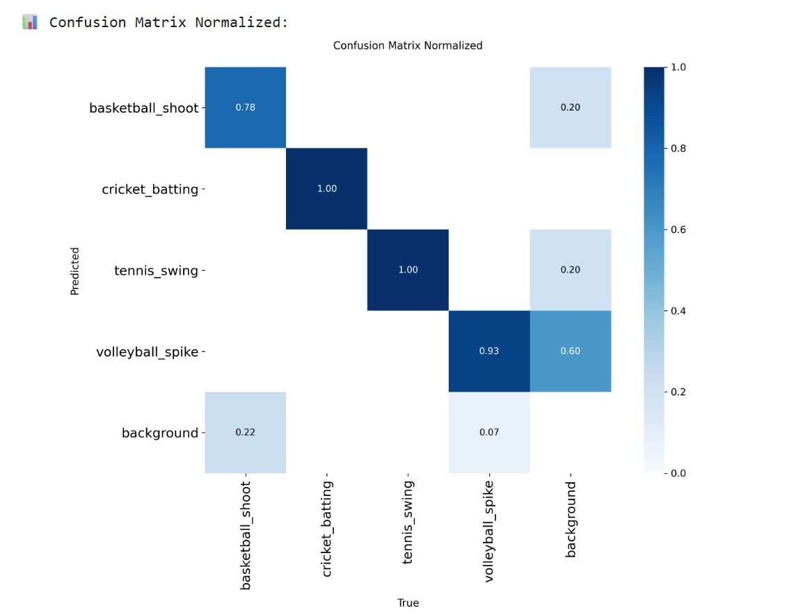

# Sport Activity Recognition

### Computer Vision & Edge AI · YOLO11n · Sony IMX500 · Raspberry Pi 5

We built this project to explore a simple question: can a small camera recognise a sports action without sending its video to the cloud? We trained a YOLO11n detector on four sports actions, exported it for the Sony IMX500 AI camera, and used a Raspberry Pi 5 to display the predictions.

The work covers the whole path from collecting and labelling images to running a camera demo. It was developed for the Artificial Intelligence & Software Development course at Deggendorf Institute of Technology (THD).

## Team

- [Tagore Thotakura](https://github.com/thotatagore26-naidu)
- [Varsha Palampalli](https://github.com/VarshaPalampalli)
- Charuphala Balasubramanian

## What it recognises

The model draws a bounding box around a player and predicts one of four labels: **basketball shoot, cricket batting, tennis swing, or volleyball spike**. This is frame-based object detection with action labels; it does not model a full movement sequence or score a player's technique.

## How we built it

1. Extracted frames from UCF101 sports videos and a self-recorded cricket video.
2. Cleaned the images and annotated player bounding boxes with LabelImg.
3. Remapped the original class IDs to the four labels used by the final model.
4. Trained YOLO11n with Ultralytics on a Google Colab T4 GPU.
5. Exported and quantized the model for IMX500, then packaged it as `network.rpk`.
6. Used Picamera2 and OpenCV to read camera predictions and draw labels on the preview.



## Dataset and training

The submission describes **916 annotated images**, an approximately **80/10/10 train/validation/test split**, and **640 × 640** training images. Training ran for 79 epochs, with the best checkpoint reported at epoch 59. The model has approximately 2.58 million parameters.

The original images, annotations, training notebook, exact dependency versions, and split manifest are not included in this submission. The dataset folder contains its description, not a downloadable training dataset.

## Reported results

These are the **pre-deployment validation results reported in the project submission**, not a new evaluation or a measurement of the quantized camera model.

| Metric | Reported value |
| --- | ---: |
| mAP@50 | 95.7% |
| Precision | 96.6% |
| Recall | 90.2% |
| F1 | 93.3% |





The demo requests 25 FPS. No measured end-to-end FPS or latency log is included, so this should be treated as a configuration setting rather than a verified benchmark. The presentation also reports limited INT8 calibration, which may affect deployment accuracy.

## Run the camera demo

You need a **Raspberry Pi 5, Sony IMX500 AI camera, and a Raspberry Pi OS environment with working IMX500 firmware, Picamera2, NumPy, and OpenCV**. A normal laptop without the camera cannot run this live demo.

Set up the camera using the [Raspberry Pi AI Camera guide](https://www.raspberrypi.com/documentation/accessories/ai-camera.html). Once the standard camera example works, clone this repository and run from its root:

```bash
git clone https://github.com/thotatagore26-naidu/sport-activity-recognition.git
cd sport-activity-recognition
python3 Source_Code/imx500_object_detection_demo.py \
  --model Model/network.rpk \
  --labels Model/labels.txt \
  --fps 25 \
  --threshold 0.25
```

Press **Ctrl+C** to stop. A graphical preview environment is required. The supplied dependency list is in `Source_Code/requirement.txt`; it is unpinned and includes training/export packages as well as runtime packages. It is not a tested standalone installer for the Raspberry Pi camera stack.

## Repository contents

| Folder | Contents |
| --- | --- |
| `Source_Code/` | Camera inference script, dependency list, and original submission README |
| `Model/` | PyTorch checkpoint, IMX export files, RPK camera package, and labels |
| `Training_results/` | Training curves, confusion matrices, and sample batches |
| `Dataset/` | Dataset collection and annotation notes |
| `Presentation/` | Original PDF and PowerPoint submission |

## What we learned and what comes next

Getting the labels and exported bounding-box format right was an important part of this project. The small dataset also makes lighting, camera angle, and crowded scenes useful areas for further evaluation.

Next steps are to calibrate with more sport-specific images, measure camera latency and accuracy, and evaluate on videos kept separate from training videos to reduce the risk of similar frames appearing across splits. Pose estimation and tracking could help with more complex scenes.

The supplied camera code and model artifacts are preserved from the submission. The camera demo has not been re-run as part of preparing this repository. The original presentation remains included as submitted; use the qualifications above when interpreting its performance claims.

## Credits

Built with Ultralytics YOLO, Raspberry Pi Picamera2, Sony IMX500 tools, OpenCV, and LabelImg. Dataset sources are described in `Dataset/DATASET_README.txt`. Third-party tools and source datasets retain their respective licenses; this repository does not grant additional rights to them.
